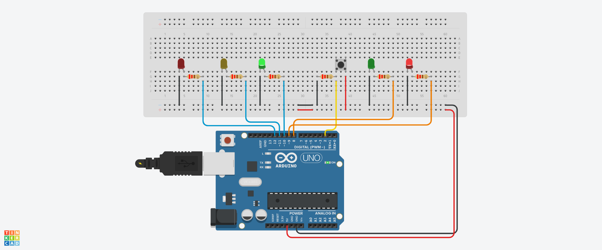

# Project 4 - Interactive Traffic Lights

## About

This is a simple Arduino project that simulates a Brazilian traffic light system with pedestrian crossing. The project uses LEDs to represent car lights and pedestrian lights, a button to simulate a pedestrian crossing, and a timer to control the length of time allowed for crossing. 

When the button is pressed, the car lights change from green to yellow and then to red, while the pedestrian lights change from red to green. After a preset amount of time, the pedestrian lights start flashing and then turn red, while the car lights change from red to green again. 

## Requirements

- Arduino board
- Five LEDs (two red, two green, one yellow)
- One button
- Six 220-ohm resistors
- Jumper wires

## Installation

1. Connect the first red LED to pin 12 of the Arduino board.
2. Connect the first yellow LED to pin 11 of the Arduino board.
3. Connect the first green LED to pin 10 of the Arduino board.
4. Connect the second red LED to pin 9 of the Arduino board.
5. Connect the second green LED to pin 8 of the Arduino board.
6. Connect a 220-ohm resistor between each LED's anode (+) and the respective pin of the Arduino board.
7. Connect the cathode (-) of all LEDs to the ground (GND) of the Arduino board.
8. Connect the button to pin 2 of the Arduino board.
9. Upload the code "project4.ino" to the Arduino board using the Arduino IDE.

## Usage

Once the code is uploaded to the Arduino board, the traffic lights will start to work. The car lights will be green, while the pedestrian lights will be red. When the button is pressed, the car lights will change to yellow and then to red, and the pedestrian lights will change to green. After a preset amount of time, the pedestrian lights will start flashing and then turn red, while the car lights will change from red to green again.

The length of time allowed for crossing can be adjusted by changing the value of the `crossTime` variable (in milliseconds) in the code.